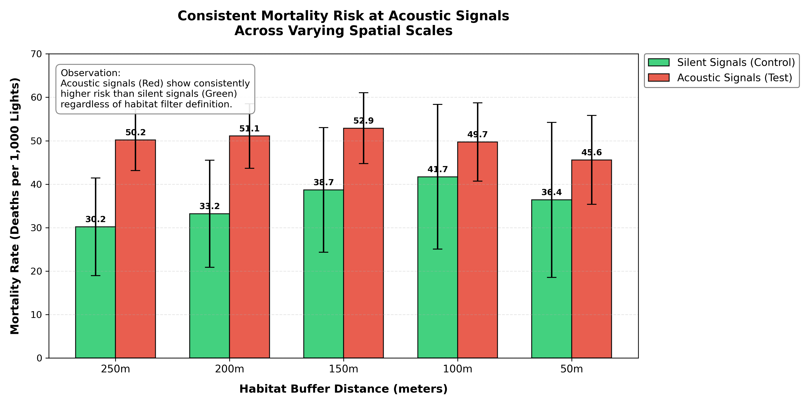

# Spatial Data Pipeline for Environmental Risk Analysis

### Project Overview
This project performs a spatial risk analysis to evaluate the impact of acoustic traffic signals on urban wildlife mortality. By fusing 7 Open Government Datasets from the City of Vienna, including biological records; infrastructure data; and topological layers, this pipeline models whether acoustic signals deter wildlife or correlate with higher roadkill rates.

### Key Findings
* **Hypothesis:** Acoustic signals act as a "Sonic Shield," reducing roadkill rates.
* **Result:** Negative correlation. Acoustic signals showed a consistently higher mortality rate (~45-50 deaths/1,000 lights) compared to silent signals (~30-36 deaths/1,000 lights) across all spatial sensitivities.
* **Statistical Verdict:** While the trend is visually consistent, the p-value (>0.05) indicates statistical insignificance due to the limited sample size of "silent" lights in valid habitat zones.



### Technical Implementation
* **Language:** Python 3.9+
* **Spatial Indexing:** Implemented `scipy.spatial.cKDTree` for high-performance nearest-neighbor queries (processing ~140,000 water/habitat points against ~1,200 infrastructure nodes).
* **Data Engineering:** Integrated disparate CSV datasets with regex coordinate parsing and custom spatial filtering.
* **Sensitivity Analysis:** Developed a "Robustness Loop" to test validity across varying spatial buffers (50m – 250m).

### Dataset Sources
This project utilizes public data from **Vienna Open Government Data (OGD)** and **Project Roadkill (GBIF)**.
To reproduce this analysis, download the following datasets and place them in the root directory:
1.  **Project Roadkill:** [GBIF Occurrence Data](https://www.gbif.org/dataset/d0d5ef85-71b2-4da6-b6f6-c1c3d60987d3)
2.  **Vienna Infrastructure:**
    * [Traffic lights without acoustic indicators - locations in Vienna](https://www.data.gv.at/datasets/961d6b7c-2920-3bce-9933-3efcb6aee472?locale=de)
    * [Traffic lights with acoustic indicators - locations in Vienna](https://www.data.gv.at/datasets/6a8b7637-f7ee-3193-8496-129f1f0e93c0?locale=de)
3.  **Vienna Environments:**
    * [Standing waters Vienna](https://www.data.gv.at/datasets/c1a9e8db-802e-3578-b8cf-9c54111e528a?locale=de)
    * [Nature reserves Vienna](https://www.data.gv.at/datasets/8a3ad371-69af-3c1c-9157-cc4a6cb67f83?locale=de)
    * [Vienna Green Belt (Waters and Open Spaces)](https://www.data.gv.at/datasets/d00af72a-b57e-32ea-928f-adad7711f5d3?locale=de)
    * [Residential streets in Vienna](https://www.data.gv.at/datasets/019ad10b-f981-366f-a424-39994c41da39?locale=de)

### Usage
```bash
# Install dependencies
pip install pandas scipy numpy matplotlib

# Run the spatial analysis pipeline

python final_analysis.py

